# Angular Task Manager

A sleek and responsive task manager built with Angular, designed to streamline your task management workflow. This project allows users to add, edit, and delete tasks with a simple, intuitive interface. Additionally, it includes admin authorization, enabling admins to manage tasks, view all accounts, and perform CRUD operations on any account.

## Features

- **Task Creation**: Easily add new tasks with a title, description, and due date.
- **Task Read**: Easily get all tasks or get task by id
- **Task Editing**: Modify existing tasks to keep your task list up-to-date.
- **Task Deletion**: Remove completed or unnecessary tasks.
- **User Authentication**: Secure login and registration functionality for users.
- **Admin Authorization**: Admins can manage tasks for all users, including creation, updates, and deletion.

## Tech Stack

- **Frontend**: Angular
- **Backend**: NodeJS, ExpressJS
- **Database**: PostgreSQL (Neon)
- **Authentication**: JWT (JSON Web Tokens) for user and admin authorization
- **Deployment**: Vercel


## Getting Start

### Prerequisite
- Node js 
- Vercel account
- PostgreSQL, pgAdmin

### Setup

1. **Clone the repository**

```bash
git clone https://github.com/hieuletainguyen/angular-task-manager.git
cd angular-task-manager
```

2. **Install Dependency**

```bash
# Install client dependencies
cd angular-task-manager-client
npm install

# Install server dependencies
cd ../server
npm install
```

3. **Configure Environment Variables**: Create a `.env` file in the root of each folder with the following:

#### Client (.env)

```.env
BACKEND_URL=
```

#### Server (.env)
```.env
JWT_SECRET_KEY=
SALT_ROUNDS=

DB_URL=

NODE_ENV=
FRONTEND_URL=
PROD_FRONTEND_URL=
```
- if NODE_ENV is development, it will use the FRONTEND_URL.
- if NODE_ENV is production, it will use the PROD_FRONTEND_URL.

4. **Set up the PostgreSQL database**:

- Create a new database on Neon 
- Go to `Quickstart`, click `Show secret` and get the DATABASE_URL

<div align="center">

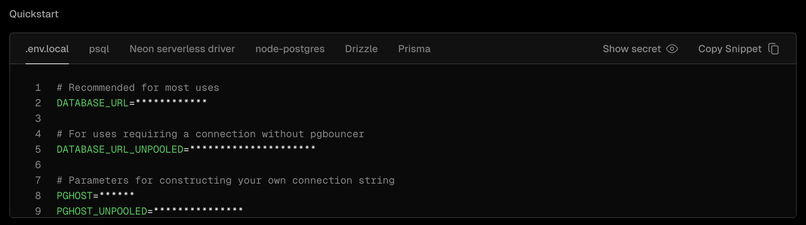
</div>

5. **Run the Application**:
```bash
# Run the dashboard
cd angular-task-manager-client
ng serve

# Run the server
cd ../server
npm start
```

6. **Access Task Manager**: For local usage, open your browser and navigate to `http://localhost:4200` and your server will be running on `http://localhost:9897`.

7. **Access Swagger**: navigate to `http://localhost:9897/api-docs`

<div align="center">

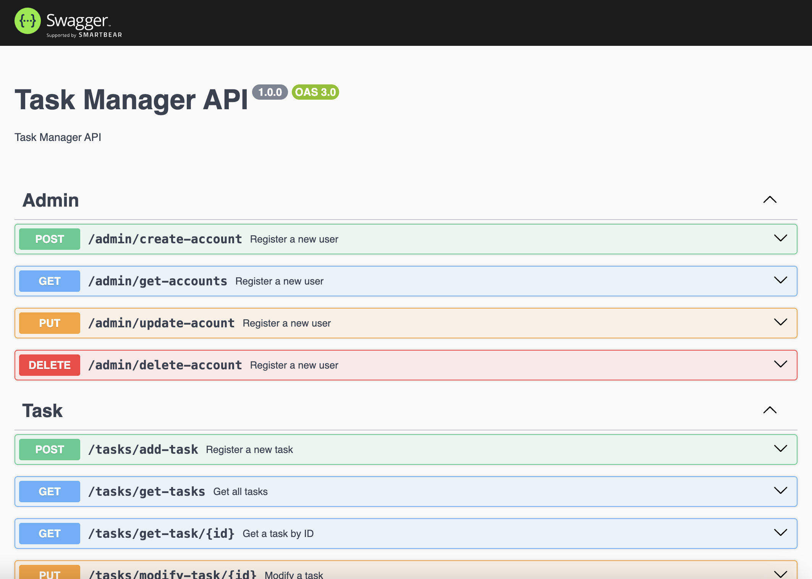
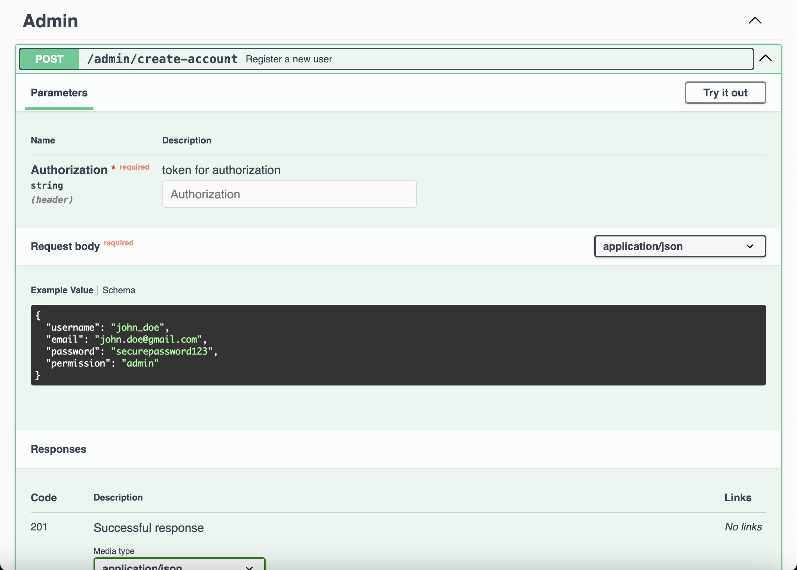
</div>

8. **Setup Github on Vercel**: 

- Go to the project dashboard, navigate the `Add New...` > `Project`

<div align="center">

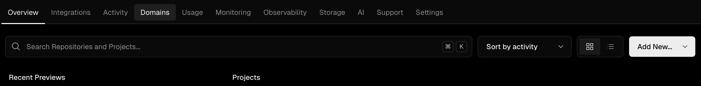
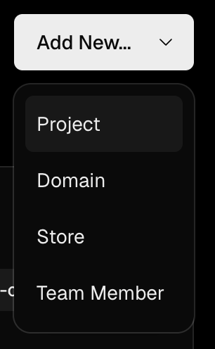
</div>

- Sign in to your Github account and select the `angular-task-manager` and `angular-task-manager-client` project.

<div align="center">

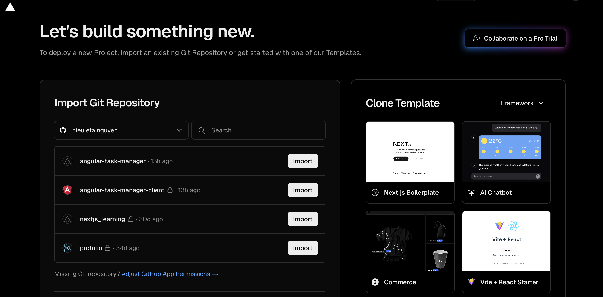
</div>

- **In case** you cannot see the project, click on `Adjust Github App Permissions`. After completing any sign in or any security, scroll down to the bottom where you will find `Repository Access`. You can choose either `All repositories` or `Only select repositories` and select `angular-task-manager` and `angular-task-manager-client`

<div align="center">

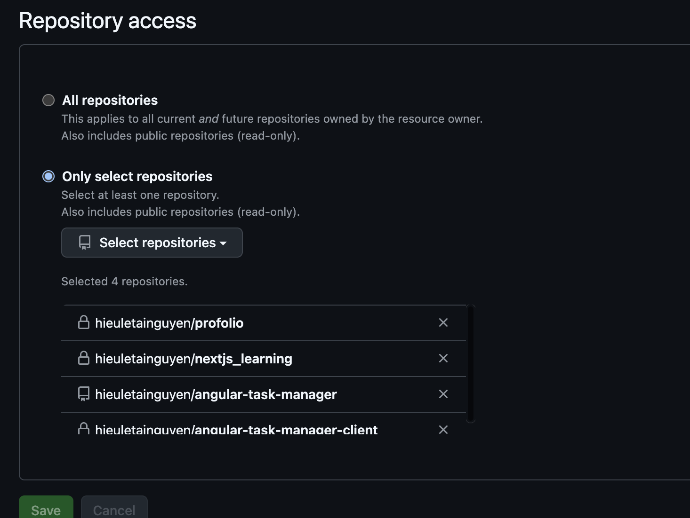
</div>

9. **Deploy client on Vercel**:

- After you click `import`, do as the following. 

<div align="center">

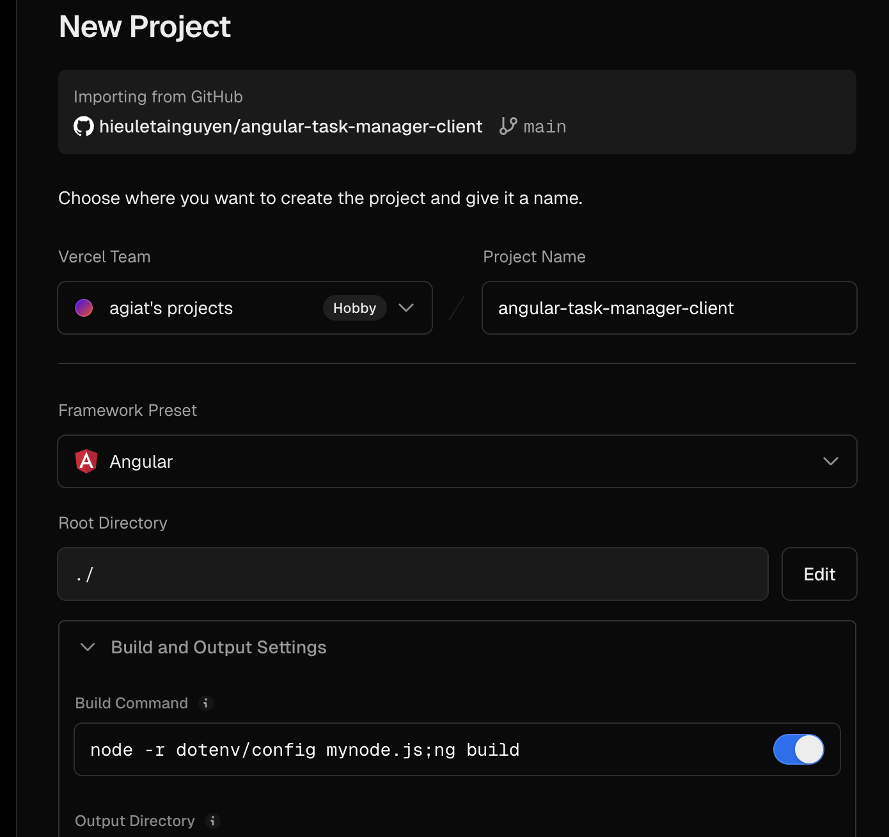
</div>

- After you deploy, you will set up the env variable. Navigate `Settings` > `Environment Variables`

<div align="center">

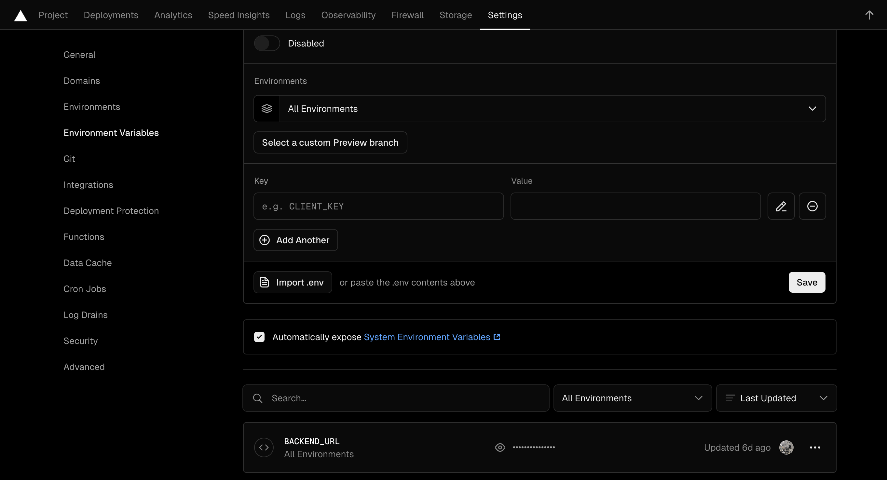
</div>

10. **Deploy server on Vercel**:

- After you click `import`, do as the following. 

<div align="center">

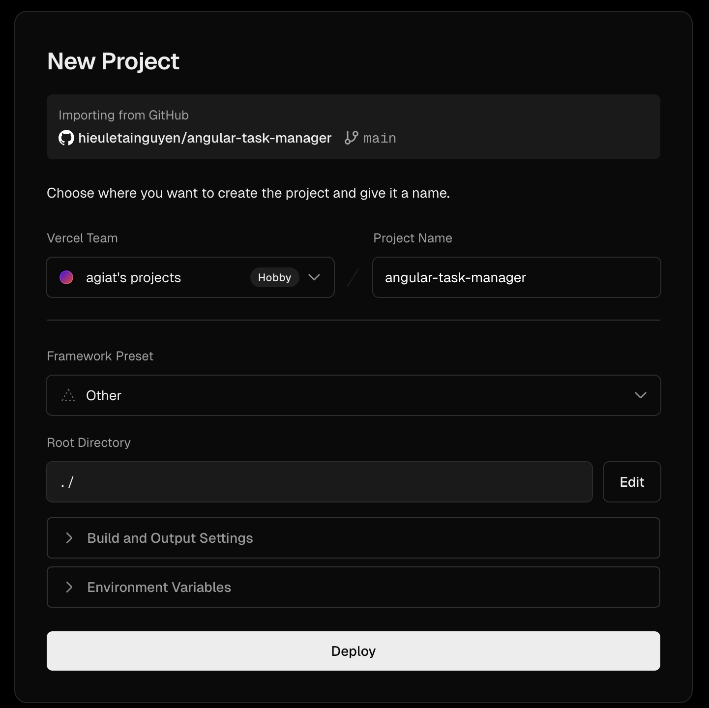
</div>

- After you deploy, you will set up the env variable. Navigate `Settings` > `Environment Variables`

<div align="center">

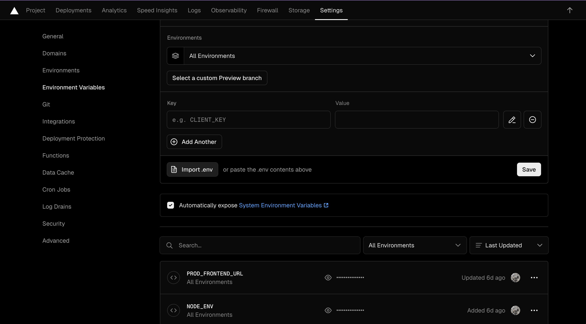
</div>

## Screenshots & Demo

- Login 

<div align="center">

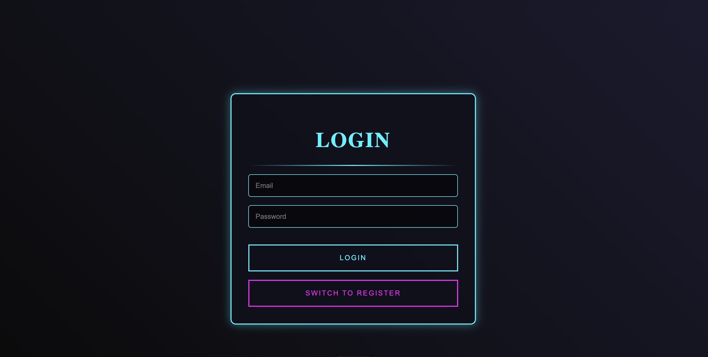
</div>

- Basic User
<div align="center">

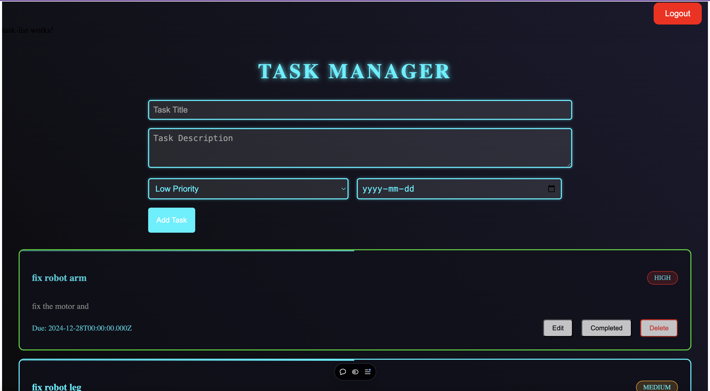
</div>
- Admin User

<div align="center">

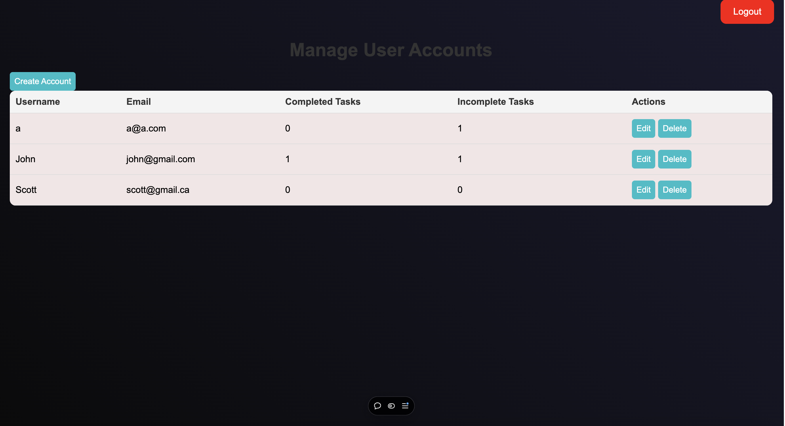
</div>

### Demo Video
<div align="center">
  
[](https://youtu.be/8KUqJyRnZUI)
</div>

---
<h2 align="center"> Tools I Have Used and Learned In This Project</h2>
<p align="center">


</p>

---